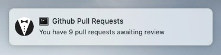

# majordome

> Github Pull Request notification utility

Majordome is a simple cli program to generate notifications if you have
open/outstanding pull-request reviews on Github. It can also be used to
display the pull-requests on the command line.

The notifications are linked to the search in the format:

`type:pr is:open review:required review-requested:<username>`

### Install & Setup

Installing:

`npm install -g majordome`

Setup:

- Majordome requires a github token to be present in your home directory
 `~/.github`
- Generate a Github token, the permissions required will depend on what
you want to monitor in your account.
- Add token to `~/.github`

### Interface

`majordome check`

Check for outstanding PR reviews, if there are more than 0 a notification
will be triggered.

`majordome list`

List all the outstanding PR reviews. The will be grouped by repository
and the title along with the age of the PR will be displayed. Depending
on the terminal, these can also be used as links - typically holding
Command (OSX) whilst clicking will trigger the link to open (Terminal.app,
iTerm, etc..)
